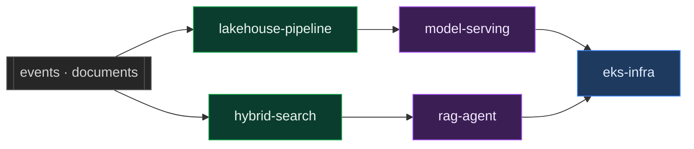

# Ahtisham Farooq

**Senior Software Engineer** · Retrieval systems, streaming data, and the infrastructure under both

France · Open to remote

---

### Projects

<table>
<tr>
<td width="50%">

Grades its own retrieval, retries, and <b>refuses</b> rather than answering from memory.

</td>
<td width="50%">

Kafka is at-least-once, so a duplicated payment reaches the daily total. This stops it.

</td>
</tr>
<tr>
<td width="50%">

Watches input drift before labels exist, and refuses to boot on a feature-order mismatch.

</td>
<td width="50%">

Vector search collapses on identifiers. BM25 and embeddings fused by rank, not score.

</td>
</tr>
<tr>
<td width="50%">

Production EKS in Terraform, with every convenient-but-wrong default overridden.

</td>
<td width="50%">

Python for services and pipelines, HCL for the infrastructure under them.

</td>
</tr>
</table>

### Stack

<b>How the five repositories fit together</b>

 

Data lands and is made trustworthy on the left, models and retrieval sit in the
middle, everything runs on the right.

### How I build

**Fail at startup, not on the first request.** A contract mismatch that surfaces under traffic is already serving users.

**Reject unexpected values, do not default them.** Defaulting an unknown currency to EUR turns a visible failure into a silent one.

**Write down the decision, not the behaviour.** Every README here says why a threshold sits where it does.
