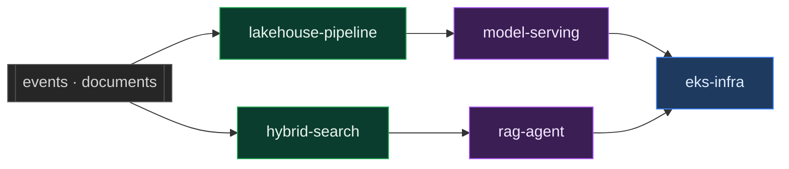

# Ahtisham Farooq

**Senior Software Engineer** · Retrieval systems, streaming data, and the infrastructure under both

France · Open to remote

`ahtishamm.farooq@gmail.com`

---

### Projects

<table>
<tr>
<td width="50%">

Grades its own retrieval, retries, and <b>refuses</b> rather than answering from memory.

</td>
<td width="50%">

Kafka is at-least-once, so a duplicated payment reaches the daily total. This stops it.

</td>
</tr>
<tr>
<td width="50%">

Watches input drift before labels exist, and refuses to boot on a feature-order mismatch.

</td>
<td width="50%">

Vector search collapses on identifiers. BM25 and embeddings fused by rank, not score.

</td>
</tr>
<tr>
<td width="50%">

A transactions warehouse in dbt. Money is NUMERIC, never FLOAT64, and cross-currency totals are <b>absent rather than approximate</b>.

</td>
<td width="50%">

Production EKS in Terraform, with every convenient-but-wrong default overridden.

</td>
</tr>
<tr>
<td width="50%">

Two collector tiers. Tail sampling keeps the failures and drops the healthy, so RED numbers come from histograms rather than sampled spans.

</td>
<td width="50%">

S3 to Postgres on Lambda. Idempotent by object etag, so a redelivery is a no-op and a gap gets reported, not silently repaired.

</td>
</tr>
</table>

Python for services and pipelines, HCL for the infrastructure under them. GitHub's language bar does not count SQL, which it classes as data alongside YAML and CSV, so the 48 KB of dbt models in <a href="https://github.com/Sam-Farooq/warehouse-models">warehouse-models</a> show up as nothing here.

### Stack

| | |
|:--|:--|
| **Languages** |      |
| **LLM and agents** |        |
| **ML** |      |
| **Search and storage** |      |
| **Data** |       |
| **Backend** |     |
| **Platform** |       |
| **Observability and testing** |       |

Every badge above appears in one of the repositories below, in a dependency file, a compose service or a Terraform resource.

<b>How the five repositories fit together</b>

 

Data lands and is made trustworthy on the left, models and retrieval sit in the
middle, everything runs on the right.

### How I build

**Fail at startup, not on the first request.** A contract mismatch that surfaces under traffic is already serving users.

**Reject unexpected values, do not default them.** Defaulting an unknown currency to EUR turns a visible failure into a silent one.

**Write down the decision, not the behaviour.** Every README here says why a threshold sits where it does.
